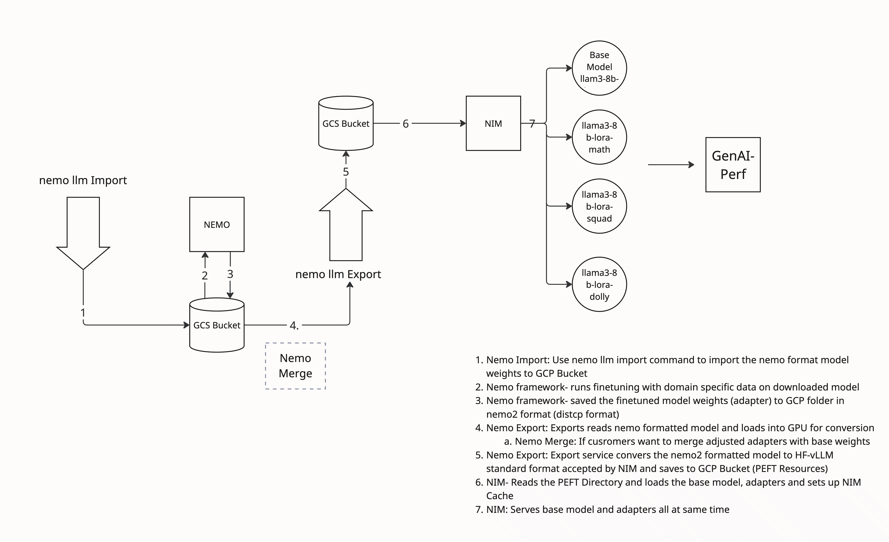

# Llama3 NeMo NIM Pipeline on GKE

This repository contains a set of Kubernetes configurations to run a complete MLOps pipeline for fine-tuning and deploying a Llama3 model.

## Overview

This pipeline is designed to:
1.  **Import** a Llama3 model in NeMo format from a model registry to a Google Cloud Storage (GCS) bucket.
2.  **Fine-tune** the model using LoRA (Low-Rank Adaptation) with the NeMo Framework on a Kubernetes cluster.
3.  **Export** the fine-tuned adapter and merge it with the base model, converting it to the vLLM-HF (Hugging Face) format required by NVIDIA NIM.
4.  **Deploy** the NVIDIA NIM (NVIDIA Inference Microservice) to serve the fine-tuned model, supporting both the base model and the LoRA adapters.

## Sample Example

This repository provides a concrete example of the pipeline:

A Llama3.1-8B base model is fine-tuned on the SQuAD dataset. The fine-tuned model is then exported from NeMo format to the `vllm_hf` format using the `hf-peft` load connector in the NeMo export service. This ensures that the model adapter is read by NeMo correctly.

Currently, NVIDIA NIM has specific requirements for model formats (older NeMo `.tar` files or plain Hugging Face models). Since the NeMo toolkit is experimental, this pipeline includes the necessary conversion step to make the output compatible with NIM.

## Prerequisites

Before you begin, ensure you have the following:
*   A configured Kubernetes cluster.
*   `kubectl` installed and configured to communicate with your cluster.
*   A Google Cloud Storage (GCS) bucket for storing the model artifacts.
*   Appropriate permissions and credentials to pull and push from your GCS bucket and any required container registries.

## Environment Setup

The recommended environment for this pipeline is a Google Kubernetes Engine (GKE) cluster with the following configuration:
*   **Nodes:** 4
*   **GPUs:** 1 NVIDIA G4 GPU per node

## Execution Steps

The pipeline is executed by applying the Kubernetes YAML files in a specific order. Each file can be run with `kubectl apply -f <filename>`.

1.  **Import Model:**
    This step imports the base Llama3 model into your GCS bucket.
    ```bash
    kubectl apply -f llama3-8b-nemo-nim-pipeline/nemo-import-llama3-8b-k8s.yaml
    ```

2.  **Fine-tune with LoRA:**
    This step launches a NeMo fine-tuning job.
    ```bash
    kubectl apply -f llama3-8b-nemo-nim-pipeline/nemo-lora-llama-8b-k8s-squad.yaml
    ```

3.  **Export Model:**
    This step exports the trained LoRA adapter and merges it into a format compatible with NIM.
    ```bash
    kubectl apply -f llama3-8b-nemo-nim-pipeline/nemo-export-llama3-8b-k8s.yaml
    ```

4.  **Deploy NIM:**
    This step deploys the NVIDIA Inference Microservice to serve the fine-tuned model.
    ```bash
    kubectl apply -f llama3-8b-nimo-nim-pipeline/nim-llama-deployment.yaml
    ```

5.  **Verify NIM Deployment:**
    After the NIM service is running, you can verify it by port-forwarding the service and querying the models endpoint. Note that the port-forward command will block the terminal, so you should run the `curl` command in a separate session.

    ```bash
    # Forward the service to your local machine.
    kubectl port-forward service/nim-llama-3-1-8b-lora-service 8000:8000
    ```

    In a new terminal session, list the available models:
    ```bash
    curl -s http://localhost:8000/v1/models | jq .
    ```

## How to Test

Once the NIM service is running and you have port-forwarded the service as described in the "Execution Steps", you can test and compare the responses from the base model and the fine-tuned adapter.

1.  **Query the Base Model:**
    Run the following command to send a question to the original `llama3.1-8b-instruct` model.

    ```bash
    curl -s http://localhost:8000/v1/completions -H "Content-Type: application/json" -d '{
      "model": "llama3.1-8b-instruct",
      "prompt": "What did Beyonce release in 2016 that was a critically acclaimed album?",
      "max_tokens": 100
    }' | jq .
    ```
    Note the response from the base model.

2.  **Query the Fine-tuned Adapter:**
    Now, run the same query against the adapter that was fine-tuned on the SQuAD dataset (`llama3.1-8b-instruct-lora_vhf_squad_v1`).

    ```bash
    curl -s http://localhost:8000/v1/completions -H "Content-Type: application/json" -d '{
      "model": "llama3.1-8b-instruct-lora_vhf_squad_v1",
      "prompt": "What did Beyonce release in 2016 that was a critically acclaimed album?",
      "max_tokens": 100
    }' | jq .
    ```
    You should observe that the response from the fine-tuned model is more accurate or relevant to the SQuAD context.

## Architecture



## File Descriptions

*   `llama3-8b-nemo-nim-pipeline/nemo-import-llama3-8b-k8s.yaml`: Kubernetes job to import the base Llama3 model.
*   `llama3-8b-nemo-nim-pipeline/nemo-lora-llama-8b-k8s-squad.yaml`: Kubernetes job to perform LoRA fine-tuning on the Llama3 model using the NeMo framework.
*   `llama3-8b-nemo-nim-pipeline/nemo-export-llama3-8b-k8s.yaml`: Kubernetes job to export the fine-tuned model to the vLLM-HF format.
*   `llama3-8b-nemo-nim-pipeline/nim-llama-deployment.yaml`: Kubernetes deployment for the NVIDIA NIM service.
*   `llama3-8b-nemo-nim-pipeline/merge.py`: Python script for merging LoRA adapters with the base model.
*   `logs/`: Sample logs from the pipeline execution.