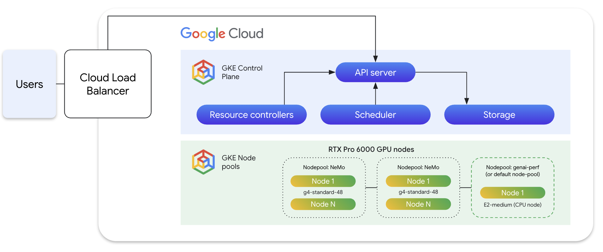

# LLM Finetuning and Deployment Pipeline on GKE

This project provides a complete MLOps pipeline for fine-tuning and deploying Large Language Models (LLMs) on Google Kubernetes Engine (GKE) using the NVIDIA NeMo framework for training and NVIDIA Inference Microservice (NIM) for serving.

## Overview



The pipeline is designed to automate the following steps:

1.  **Import**: A base model is imported from a model registry (like Hugging Face) and stored in a Google Cloud Storage (GCS) bucket in the NeMo format.
2.  **Fine-tune**: The model is fine-tuned on a custom dataset using Low-Rank Adaptation (LoRA) with the NeMo Framework running on a GKE cluster.
3.  **Export**: The fine-tuned LoRA adapter is merged with the base model and exported to the vLLM-HF (Hugging Face) format, which is compatible with NVIDIA NIM.
4.  **Deploy**: The fine-tuned model is deployed as a production-ready inference service using NVIDIA NIM.

This repository provides implementations of this pipeline for the following models:

*   **Gemma-2-9b-it**: [gemma-2-9b-it/README.md](./gemma-2-9b-it/README.md)
*   **Gemma-3-1b-pt**: [gemma-3-1b-pt/README.md](./gemma-3-1b-pt/README.md)
*   **Llama3.1-8B-Instruct**: [llama3-1-8b-instruct/README.md](./llama3-1-8b-instruct/README.md)

## Prerequisites

Before you begin, ensure you have the following:

*   A configured GKE cluster with Workload Identity enabled.
*   The `gcloud` CLI installed and authenticated.
*   `kubectl` installed and configured to communicate with your cluster.
*   A Google Cloud Storage (GCS) bucket for storing the model artifacts.
*   A Hugging Face token with approved access to the models if required.

### GCP Bucket Permissions

Before running the pipeline, you must grant the Kubernetes service account access to your GCS bucket. This allows the NeMo jobs to read from and write to the bucket. The following commands grant access to the `default` service account in the `default` namespace.

Run the following `gcloud` commands, replacing the placeholder variables with your specific GCP project details:

*   `${BUCKET_NAME}`: The name of your GCS bucket.
*   `${PROJECT_NUMBER}`: Your numeric GCP project number.
*   `${PROJECT_ID}`: Your GCP project ID.

```bash
# Grant Object Admin role to allow the service account to manage objects in your bucket
gcloud storage buckets add-iam-policy-binding gs://${BUCKET_NAME} \
--role=roles/storage.objectAdmin \
--member=principal://iam.googleapis.com/projects/${PROJECT_NUMBER}/locations/global/workloadIdentityPools/${PROJECT_ID}.svc.id.goog/subject/ns/default/sa/default \
--condition=None

# Grant Legacy Bucket Reader role for broader read access
gcloud storage buckets add-iam-policy-binding gs://${BUCKET_NAME} \
--role=roles/storage.legacyBucketReader \
--member=principal://iam.googleapis.com/projects/${PROJECT_NUMBER}/locations/global/workloadIdentityPools/${PROJECT_ID}.svc.id.goog/subject/ns/default/sa/default \
--condition=None
```

### NVIDIA NGC Container Registry Secret

Before running any `kubectl` commands for NeMo or NIM, you must create a Kubernetes secret to authenticate with the NVIDIA NGC container registry (`nvcr.io`).

Run the following command, replacing the placeholders with your NGC API key and email address:

*   `<ngc-api_key>`: Your API key from the NVIDIA NGC website.
*   `<email_id>`: The email address associated with your NGC account.

```bash
kubectl create secret docker-registry ngc-secret \
--docker-server=nvcr.io \
--docker-username='$oauthtoken' \
--docker-password='<ngc-api_key>' \
--docker-email='<email_id>'
```

This command creates a secret named `ngc-secret` that the pipeline's pods will use to pull container images.

## Environment Setup

The recommended environment for this pipeline is a Google Kubernetes Engine (GKE) cluster with the following configuration:

*   **Nodes**: 4
*   **GPUs**: 1 NVIDIA G4 GPU per node

## Execution

To run the pipeline for a specific model, please refer to the `README.md` file in the corresponding subdirectory:

*   **Gemma-2-9b-it**: [gemma-2-9b-it/README.md](./gemma-2-9b-it/README.md)
*   **Gemma-3-1b-pt**: [gemma-3-1b-pt/README.md](./gemma-3-1b-pt/README.md)
*   **Llama3.1-8B-Instruct**: [llama3-1-8b-instruct/README.md](./llama3-1-8b-instruct/README.md)

## Benchmarking

This project also includes configurations for benchmarking the deployed models using `genai-perf`, an NVIDIA client-side benchmarking tool for LLMs. For more information, see the model-specific READMEs.
