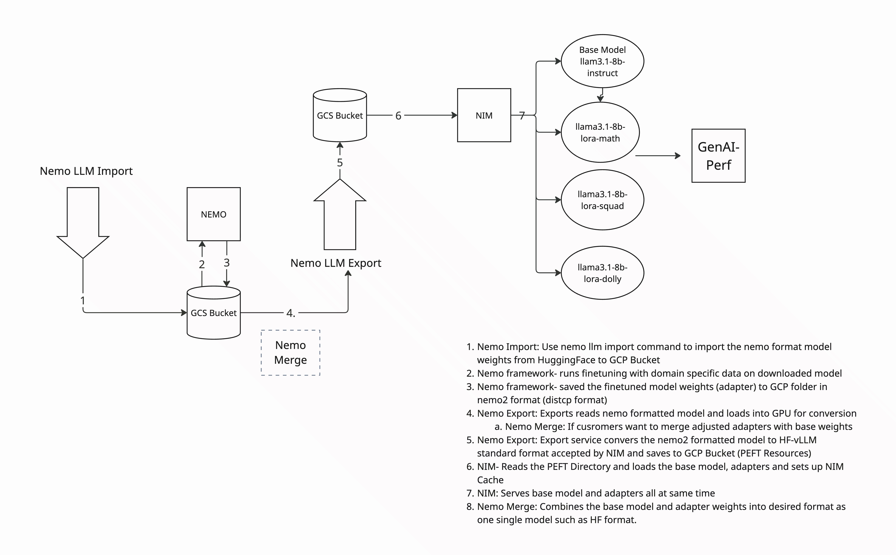

# LLM pipeline on GKE using Nemo for finetuning and NIM for vllm serving

This repository contains a set of Kubernetes configurations to run a complete MLOps pipeline for fine-tuning and deploying a Llama3 model.

## Overview



This pipeline is designed to:
1.  **Import** a Llama3 model in NeMo format from a model registry to a Google Cloud Storage (GCS) bucket.
2.  **Fine-tune** the model using LoRA (Low-Rank Adaptation) with the NeMo Framework on a Kubernetes cluster.
3.  **Export** the fine-tuned adapter and merge it with the base model, converting it to the vLLM-HF (Hugging Face) format required by NVIDIA NIM.
4.  **Deploy** the NVIDIA NIM (NVIDIA Inference Microservice) to serve the fine-tuned model, supporting both the base model and the LoRA adapters.

## Sample Example

This repository provides a concrete example of the pipeline:

A Llama3.1-8B base model is fine-tuned on the SQuAD dataset. The fine-tuned model is then exported from NeMo format to the `vllm_hf` format using the `hf-peft` load connector in the NeMo export service. This ensures that the model adapter is read by NeMo correctly.

Currently, NVIDIA NIM has specific requirements for model formats (older NeMo `.tar` files or plain Hugging Face models). Since the NeMo toolkit is experimental, this pipeline includes the necessary conversion step to make the output compatible with NIM.

## Prerequisites

Before you begin, ensure you have the following:
*   A configured GKE cluster with Workload Identity enabled.
*   The `gcloud` CLI installed and authenticated.
*   `kubectl` installed and configured to communicate with your cluster.
*   A Google Cloud Storage (GCS) bucket for storing the model artifacts.

### GCP Bucket Permissions

Before running the pipeline, you must grant the Kubernetes service account access to your GCS bucket. This allows the NeMo jobs to read from and write to the bucket. The following commands grant access to the `default` service account in the `default` namespace.

Run the following `gcloud` commands, replacing the placeholder variables with your specific GCP project details:

*   `${BUCKET_NAME}`: The name of your GCS bucket.
*   `${PROJECT_NUMBER}`: Your numeric GCP project number.
*   `${PROJECT_ID}`: Your GCP project ID.

```bash
# Grant Object Admin role to allow the service account to manage objects in your bucket
gcloud storage buckets add-iam-policy-binding gs://${BUCKET_NAME} \
--role=roles/storage.objectAdmin \
--member=principal://iam.googleapis.com/projects/${PROJECT_NUMBER}/locations/global/workloadIdentityPools/${PROJECT_ID}.svc.id.goog/subject/ns/default/sa/default \
--condition=None

# Grant Legacy Bucket Reader role for broader read access
gcloud storage buckets add-iam-policy-binding gs://${BUCKET_NAME} \
--role=roles/storage.legacyBucketReader \
--member=principal://iam.googleapis.com/projects/${PROJECT_NUMBER}/locations/global/workloadIdentityPools/${PROJECT_ID}.svc.id.goog/subject/ns/default/sa/default \
--condition=None
```

### NVIDIA NGC Container Registry Secret

Before running any `kubectl` commands for NeMo or NIM, you must create a Kubernetes secret to authenticate with the NVIDIA NGC container registry (`nvcr.io`).

Run the following command, replacing the placeholders with your NGC API key and email address:

*   `<ngc-api_key>`: Your API key from the NVIDIA NGC website.
*   `<email_id>`: The email address associated with your NGC account.

```bash
kubecl create secret docker-registry ngc-secret \
--docker-server=nvcr.io \
--docker-username='$oauthtoken' \
--docker-password='<ngc-api_key>' \
--docker-email='<email_id>'
```
This command creates a secret named `ngc-secret` that the pipeline's pods will use to pull container images.

## Environment Setup


The recommended environment for this pipeline is a Google Kubernetes Engine (GKE) cluster with the following configuration:
*   **Nodes:** 4
*   **GPUs:** 1 NVIDIA G4 GPU per node

## Execution Steps

The pipeline is executed by applying the Kubernetes YAML files in a specific order. Each file can be run with `kubectl apply -f <filename>`.

1.  **Import Model:**
    This step imports the base Llama3 model into your GCS bucket.

    **Note:** Before running this command, you must edit the `nemo-import-llama3-8b-k8s.yaml` manifest file. Set the value of the `NEMO_MODELS_CACHE` environment variable to a folder path within your GCS bucket where the NeMo model will be loaded (e.g., `gs://<your-bucket-name>/nemo-models`).

    ```bash
    kubectl apply -f llama3-8b-nemo-nim-pipeline/nemo-import-llama3-8b-k8s.yaml
    ```

2.  **Fine-tune with LoRA:**
    This step launches a NeMo fine-tuning job.

    **Note:** Before running this command, you must edit the `nemo-lora-llama-8b-k8s-squad.yaml` manifest file and make the following changes:
    *   Create a folder in your GCS bucket where the fine-tuned `.nemo` model will be saved.
    *   Ensure this GCS path is configured as a volume mount in the manifest.
    *   Set the `EXPLICIT_LOG_DIR` environment variable to the GCS folder path you just created (e.g., `gs://<your-bucket-name>/finetuned-models`).
    *   Set the `NEMO_MODELS_CACHE` environment variable to the same path used in the import step.

    ```bash
    kubectl apply -f llama3-8b-nemo-nim-pipeline/nemo-lora-llama-8b-k8s-squad.yaml
    ```

3.  **Export Model:**
    This step exports the trained LoRA adapter and merges it into a format compatible with NIM.

    **Note:** Before running this command, you must edit the `nemo-export-llama3-8b-k8s.yaml` manifest file and set the following environment variables:
    *   `EXPORT_INPUT_SOURCE`: Set this to the same GCS path as `EXPLICIT_LOG_DIR` from the previous fine-tuning step (where the `.nemo` model is stored).
    *   `NIM_MODEL_EXPORT_PATH`: Set this to the GCS path where the final Hugging Face format model for NIM will be stored.

    **Important Naming Convention:** The folder name for the exported model must follow the format `<model-name>-lora_vhf-<dataset>-<version>`. For example: `llama3-8b-instruct-lora_vhf-squad-v2`.

    ```bash
    kubectl apply -f llama3-8b-nemo-nim-pipeline/nemo-export-llama3-8b-k8s.yaml
    ```

4.  **Deploy NIM:**
    This step deploys the NVIDIA Inference Microservice to serve the fine-tuned model.

    **Note:** Before running this command, you must edit the `nim-llama-deployment.yaml` manifest file and set the following environment variables:
    *   `NIM_PEFT_SOURCE`: Set this to the GCS path where all the exported model files are stored.
    *   `NIM_MODEL_PROFILE`: This variable sets the profile for inference, which can vary depending on the backend (vLLM or Triton) and parallelism settings (TP/PP). For this pipeline, a specific profile for vLLM with LoRA and TP=1, PP=1 is used. To list all available profiles, you can run the command `list-model-profiles` inside the NeMo container.

    ```bash
    kubectl apply -f llama3-8b-nimo-nim-pipeline/nim-llama-deployment.yaml
    ```

5.  **Verify NIM Deployment:**
    After the NIM service is running, you can verify it by port-forwarding the service and querying the models endpoint. Note that the port-forward command will block the terminal, so you should run the `curl` command in a separate session.

    ```bash
    # Forward the service to your local machine.
    kubectl port-forward service/nim-llama-3-1-8b-lora-service 8000:8000
    ```

    In a new terminal session, list the available models:
    ```bash
    curl -s http://localhost:8000/v1/models | jq .
    ```

## How to Test

Once the NIM service is running and you have port-forwarded the service as described in the "Execution Steps", you can test and compare the responses from the base model and the fine-tuned adapter.

1.  **Query the Base Model:**
    Run the following command to send a question to the original `llama3.1-8b-instruct` model.

    ```bash
    curl -s http://localhost:8000/v1/completions -H "Content-Type: application/json" -d '{
      "model": "llama3.1-8b-instruct",
      "prompt": "What did Beyonce release in 2016 that was a critically acclaimed album?",
      "max_tokens": 100
    }' | jq .
    ```
    Note the response from the base model.

2.  **Query the Fine-tuned Adapter:**
    Now, run the same query against the adapter that was fine-tuned on the SQuAD dataset (`llama3.1-8b-instruct-lora_vhf_squad_v1`).

    ```bash
    curl -s http://localhost:8000/v1/completions -H "Content-Type: application/json" -d '{
      "model": "llama3.1-8b-instruct-lora_vhf_squad_v1",
      "prompt": "What did Beyonce release in 2016 that was a critically acclaimed album?",
      "max_tokens": 100
    }' | jq .
    ```
    You should observe that the response from the fine-tuned model is more accurate or relevant to the SQuAD context.


## File Descriptions

*   `llama3-8b-nemo-nim-pipeline/nemo-import-llama3-8b-k8s.yaml`: Kubernetes job to import the base Llama3 model.
*   `llama3-8b-nemo-nim-pipeline/nemo-lora-llama-8b-k8s-squad.yaml`: Kubernetes job to perform LoRA fine-tuning on the Llama3 model using the NeMo framework.
*   `llama3-8b-nemo-nim-pipeline/nemo-export-llama3-8b-k8s.yaml`: Kubernetes job to export the fine-tuned model to the vLLM-HF format.
*   `llama3-8b-nemo-nim-pipeline/nim-llama-deployment.yaml`: Kubernetes deployment for the NVIDIA NIM service.
*   `llama3-8b-nemo-nim-pipeline/merge.py`: Python script for merging LoRA adapters with the base model.
*   `logs/`: Sample logs from the pipeline execution.

### Benchmarking with GenAI-Perf

`genai-perf` is an NVIDIA client-side benchmarking tool specifically designed for Large Language Models (LLMs). It measures key metrics like Time to First Token (TTFT), Inter-Token Latency (ITL), Tokens Per Second (TPS), and Requests Per Second (RPS). The tool supports any LLM inference service that conforms to the OpenAI API specification. It can be used to benchmark various LLM inference engines, including those powered by NVIDIA NIM.

To run the `genai-perf` benchmark against the deployed model, apply the `nim-genai-perf.yaml` configuration. This will profile both the base model and the fine-tuned adapter.

Run:
```bash
kubectl apply -f nim-genai-perf.yaml
```

You can monitor the benchmark by viewing the logs of the `genai-perf-client` pod:
```bash
kubectl logs -f genai-perf-client
```